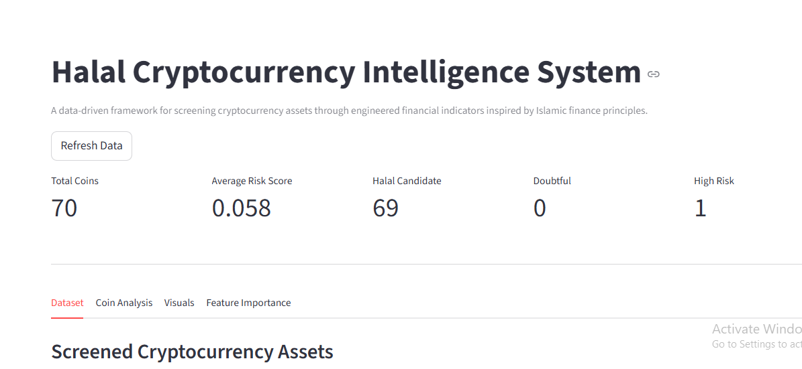
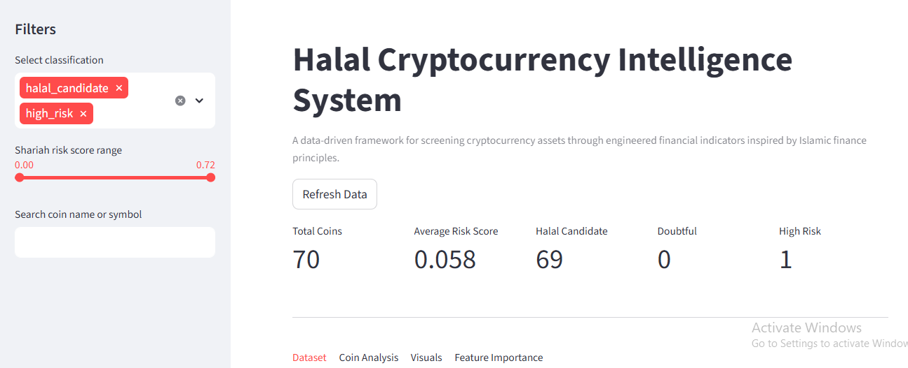
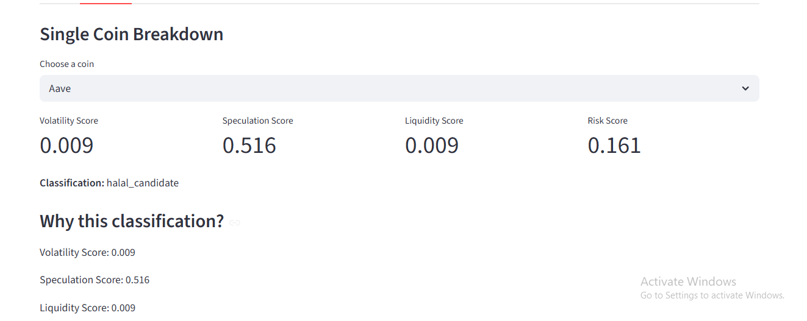
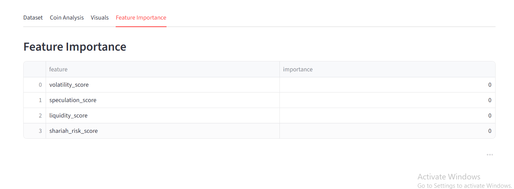

# Halal Crypto Intelligence System

<p align="center">
  
</p>

<p align="center">
  <b>A data-driven system for screening cryptocurrency assets using Islamic finance principles.</b>
</p>

<p align="center">
   Built with Streamlit •  Machine Learning •  Data Analysis •  Shariah Logic
</p>


##  Overview

The **Halal Crypto Intelligence System** is a machine learning-powered application designed to:

* Analyze cryptocurrency assets using engineered financial indicators
* Classify coins into:

  * 🟢 Halal Candidate
  * 🟡 Doubtful
  * 🔴 High Risk
* Provide **explainable insights** behind each classification
* Integrate **Islamic finance concepts** like *riba*, *gharar*, and speculation


**Problem Statement**
The rapid growth of cryptocurrency markets and various cryptocurrcy projects has made it difficult for
Muslim investors to assess whether digital assets align with Islamic financial principles.

**Key challenges include:**
 * Lack of structured screening frameworks
 * High speculation and volatility
 * Absence of transparency, expainable risk classification

This project addresses these gaps by building a **data_driven screening model** that approximates risk classification


**Methodology**

The system follow a full data pipeline:

1. **Data Collection**

 * Cryptocurrency data is gathered and structured from coin_gecko, coin market cap, .... into a dataset.

2. **Data Cleaning**

 * Handles missing values from the data gathered in this dataset
 * Ensures numeric consistency
 * Prepares data for modeling

3. **Feature Engineering**

key indicators:
 * Volatility_score = price instability
 * speculation_score = trading-friven activity
 * liquidity_score = market depth
 * shariah_risk_score = combined risk proxy

 4. **Classification Model**
A machine learning model used to classify assets into:

  if score < threshold_1 = hala_candidate
  elif < threshold_2 = doubtful
  else = high_risk

Note: Thresholds can be manual or data-driven (quantile-based).

5. **Evaluation**

Model performance is evaluated using:

 * Accuracy score
 * Classification report
 * Confusion matrix

Outputs are saved to:

outputs/tables/


##  Key Features

###  Intelligent Screening

* Uses:

  * Volatility score
  * Speculation score
  * Liquidity score

 * Automatically classifies coins into risk categories


###  Explainability (VERY IMPORTANT)

* Shows **WHY** a coin is classified as:

  * High risk
  * Doubtful
  * Halal candidate

* Example:

  > "This coin is mainly driven by HIGH VOLATILITY"


###  Feature Importance

* Displays ML feature contribution
* Helps understand:

  * What drives risk decisions


###  Interactive Dashboard

* Built with **Streamlit**

* Includes:

  * Filters (classification, risk range)
  * Search system
  * Tabs:

    * Dataset
    * Coin Analysis
    * Visuals


###  Live Data Awareness

* Displays:

  * Last updated timestamp


###  Dashboard Overview

<p align="center">
  
</p>


###  Filtering System

<p align="center">
  
</p>


###  Coin Breakdown (Explainability)

<p align="center">
  
</p>


###  Feature Importance

<p align="center">
  
</p>


##  Tech Stack

* **Python**
* **Pandas**
* **Scikit-learn**
* **Streamlit**
* **NumPy**


##  Machine Learning Pipeline

1. Data Collection
2. Data Cleaning
3. Feature Engineering
4. Model Training
5. Classification
6. Explainability Layer


##  Project Structure

halal-crypto-intelligence/
│
├── app/
│   └── streamlit_app.py
│
├── src/
│   ├── data_collection.py
│   ├── data_cleaning.py
│   ├── feature_engineering.py
│   ├── screening_model.py
│   ├── visualization.py
│
├── outputs/
│   └── tables/
│       ├── classification_report.csv
│       ├── confusion_matrix.csv
│       └── feature_importance.csv
│
├── assets/
│   └── images/
│
└── requirements.txt


##  How to Run

### 1. Install dependencies

```bash
pip install -r requirements.txt
```

### 2. Run model pipeline

```bash
python src/screening_model.py
```

### 3. Launch Streamlit app

```bash
streamlit run app/streamlit_app.py
```

## Limitations

*  Simplified risk proxy (not full Shariah compliance model)
*  Features importance may be unstable
*  class imbalance (some categories underresented)

##  Future Improvements

*  larger and real datasets
*  Auto-refresh data pipeline
*  Advanced ML models
*  Deeper Islamic finance rules (riba, gharar detection)
*  Deploy live (Streamlit Cloud / AWS)


## Research Potential

This project can be extended into:

*  Islamic fintech research
*  Ethical AI in finance
*  Cryptocurrency compliance systems
*  Decision-support tools for Muslim investors


##  Contribution

Contributions are welcome!

* Fork the repo
* Create a branch
* Submit a pull request


##  License

MIT License


##  Author

**Bashiru Mustapha**

Backend & App Developement • Data Science / Analysis • Islamic Finance / Crypto enthusiast 


## Final Note

This project demonstrates how **data science can be applied to ethical financial decision-making**, bridging modern technology with traditional principles.

<p align="center">
   If you like this project, give it a star!
</p>
